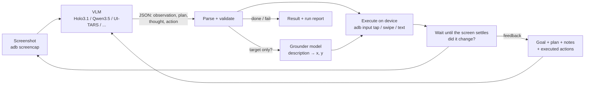

# android-automation [](https://github.com/yasirfaizahmed/twitter_automation/actions/workflows/ci.yml)

Automate **any Android app** with a vision-language model. No XPaths, element IDs or
template images: the model looks at the screen like a person does, breaks the goal into
steps, and answers with JSON actions (tap here, type this, scroll, open that app) that
are executed over ADB. After every action it sees the new screen and corrects course.

> This repo started as Selenium-based Twitter automation. That version broke every time
> X changed its markup; it now lives in [`legacy/`](legacy/README.md). The VLM approach
> survives UI redesigns because nothing is tied to the app's internals.



Each turn the model returns one step:

```json
{
  "observation": "X home timeline. A blue + button is at the bottom right.",
  "plan": ["open the composer", "type the post", "tap Post", "confirm it was sent"],
  "thought": "The + button opens the composer.",
  "note": "",
  "action": {"type": "tap", "target": "blue + compose button, bottom right", "x": 905, "y": 878}
}
```

Coordinates are in the model's own space (0-1000 for Holo/Qwen models) and are mapped to
device pixels by the executor.

## Features

- **Any app, any model.** Talks to any OpenAI-compatible server (vLLM, SGLang, Ollama,
  LM Studio, llama.cpp, hosted APIs), or runs a Hugging Face model in-process.
- **Plan and feedback loop.** The model keeps a broken-down plan, notes, and the history
  of executed actions with their results ("the screen did not change", "FAILED: ...").
- **Robust output handling.** JSON-schema constrained decoding where the server supports
  it, plus a forgiving parser that understands other models' action vocabularies
  (`click`, `coordinate: [x, y]`, `terminate`, ...) and retries with the error.
- **Planner + grounder split** (optional): a strong general model decides *what* to do;
  a small GUI-specialised model (e.g. Holo3.1) decides *where* to tap.
- **Secrets stay secret.** The model types `{{X_PASSWORD}}`; the executor substitutes
  the value from the environment. The value never reaches the model or the logs.
- **Safety rails.** `--dry-run` (observe only), `--confirm` (approve each action),
  stuck detection, step budget, and an `ask_user` action for OTPs.
- **Run recordings.** Every run saves screenshots, annotated actions, raw model output and
  an HTML report under `runs/`. The `steps.jsonl` + PNGs double as a fine-tuning dataset.
- **Reusable YAML tasks** with parameters, app launch/reset, and file push (e.g. post an
  image you generated).

## Quick start

### 1. Phone (or emulator)

Enable *Developer options → USB debugging*, plug the phone in, accept the prompt, and check:

```bash
adb devices          # from Android platform-tools
```

Wireless debugging works too: `android-automation connect 192.168.1.20:37123`.
An Android Studio emulator works out of the box. For non-ASCII typing (emoji, Arabic,
Urdu) install [ADBKeyboard](https://github.com/senzhk/ADBKeyBoard) and enable it once in
keyboard settings; the agent switches to it only while typing.

### 2. Install

```bash
python3 -m venv .venv && source .venv/bin/activate
pip install -e .              # OpenAI-compatible client only (no torch)
pip install -e '.[local]'     # + transformers backend for in-process inference
```

### 3. Serve a model

The defaults target a single 12-16 GB GPU with
[Holo3.1-4B](https://huggingface.co/Hcompany/Holo-3.1-4B) behind vLLM:

```bash
vllm serve Hcompany/Holo-3.1-4B \
  --max-model-len 16384 --max-num-seqs 8 \
  --limit-mm-per-prompt '{"image": 3, "video": 0}'
```

or with Docker: `docker compose -f deploy/docker-compose.model.yml up -d` (see [Docker](#docker)).

### 4. Check and run

```bash
android-automation check                        # adb, device, model endpoint
android-automation ground "the Settings search icon"   # test grounding, writes ground.png
android-automation run "Turn on dark theme" --app settings
android-automation task examples/tasks/x_post.yaml -p text="Assalamu alaikum"
```

Open `runs/<timestamp>_<goal>/report.html` to replay what the agent saw and did.

## Choosing a model

| Model | Hardware | Notes |
|---|---|---|
| `Hcompany/Holo-3.1-4B` (default) | 12-16 GB GPU | Apache 2.0, ~71% on AndroidWorld |
| `Hcompany/Holo-3.1-9B` | 24 GB GPU | Apache 2.0, same benchmark tier, more headroom |
| `Hcompany/Holo-3.1-35B-A3B` (FP8 / NVFP4 / GGUF) | 24-48 GB GPU | Apache 2.0, 79.3% on AndroidWorld, MoE with 3B active |
| `Qwen/Qwen3.5-*`, other Qwen-family GUI models | varies | Set `coordinate_space` to match the model |
| Any hosted VLM with an OpenAI-compatible API | none | Use as planner with a local Holo grounder |

Benchmark figures are from H Company's
[Holo3.1 announcement](https://huggingface.co/blog/Hcompany/holo31). Swap models with
`--model` / `--base-url` or in the config. Things to match per model:

- `coordinate_space`: `normalized_1000` for Qwen3-VL / Qwen3.5 based models (Holo2, Holo3.x),
  `pixel` for Qwen2.5-VL based ones (Holo1.5, UI-TARS-1.5), `normalized_1` for 0..1.
  If taps land consistently off-target, this is the first thing to check; the `ground`
  command makes it quick to verify.
- `chat_template_kwargs`: thinking is disabled by default for speed (the JSON already has a
  `thought` field). Clear it for hosted APIs, which reject unknown fields:
  `-s "model.chat_template_kwargs={}"`.
- `image.factor`: the vision encoder's patch size × merge size (32 for Qwen3-VL/Qwen3.5,
  28 for Qwen2.5-VL).

### Planner + grounder

```bash
android-automation run "..." -c configs/planner_grounder.yaml
```

The planner writes `"target": "blue Post button, top right"`; the grounder returns the
coordinates. With a grounder configured, every targeted tap goes through it. Without one,
the main model's own `x`/`y` are used, and an action that only names a target is grounded
by the main model with a localisation prompt.

## Task files

```yaml
# examples/tasks/x_like_latest_post.yaml
name: x-like-latest-post
app: x                    # launched before the agent starts (name or package)
reset_app: false          # force-stop first for a clean state
goal: >
  Open the profile of {{handle}} using search, find their most recent post (skip pinned
  posts), and like it. Report the first line of the post in your answer.
params:
  handle: "@NASA"
max_steps: 25
```

```bash
android-automation task examples/tasks/x_like_latest_post.yaml -p handle=@Google
```

More in [`examples/tasks/`](examples/tasks): posting text or an image on X, logging in
with secrets, WhatsApp, YouTube search, and device-settings tasks that work on any phone.
App names are resolved through built-in aliases (`x`, `youtube`, `whatsapp`, ...), the
`apps:` section of the config, and fuzzy matching against installed packages.

### Secrets

```yaml
secrets: [X_USERNAME, X_PASSWORD]
goal: Log in with username {{X_USERNAME}} and password {{X_PASSWORD}}.
```

The values come from environment variables. The model only sees the placeholders and
types `{"type": "type", "text": "{{X_PASSWORD}}"}`; the executor fills them in at the last
moment. Only declared names are substituted, so a model cannot ask for arbitrary
environment variables. For ad-hoc runs: `android-automation run "..." --secret X_PASSWORD`.

## Python API

```python
from android_automation import Agent, Task, load_config, run_task

agent = Agent.from_config(load_config())
result = run_task(agent, Task(goal="What is the battery percentage?", app="settings"))
print(result.status, result.answer, result.run_dir)
```

`Agent` takes any `Device` and any `VLM`, so you can plug in another transport
(uiautomator2, Appium, a device farm) or model client by implementing a small interface.
See [`examples/python_api.py`](examples/python_api.py).

## Configuration

[`configs/default.yaml`](configs/default.yaml) documents every option. Precedence, lowest
first: config file → `ANDROID_AUTOMATION__SECTION__KEY` environment variables →
CLI flags (`--model`, `--base-url`, `--serial`, ...) → `-s key=value`.

```bash
android-automation run "..." -s agent.history_images=2 -s model.temperature=0.2
ANDROID_AUTOMATION__MODEL__BASE_URL=http://gpu-box:8000/v1 android-automation check
```

## Docker

Two compose files in [`deploy/`](deploy), usable together or apart:

| File | What it runs |
|---|---|
| `docker-compose.model.yml` | vLLM serving the VLM on `localhost:8000` (needs an NVIDIA GPU + Container Toolkit) |
| `docker-compose.agent.yml` | Builds the project image (package, adb, ADBKeyboard APK) and runs the CLI |

```bash
cp deploy/.env.example deploy/.env            # model, device and secret settings

# model server
docker compose -f deploy/docker-compose.model.yml up -d

# agent: everything after `agent` is passed to the android-automation CLI
docker compose -f deploy/docker-compose.agent.yml run --rm agent check
docker compose -f deploy/docker-compose.agent.yml run --rm agent run "Turn on dark theme" --app settings
```

The image is built from your checkout on first use and rebuilt (from cache, a few seconds)
on every run, so code changes are picked up; nothing but the Python base image is pulled.

The agent reaches the model at `http://host.docker.internal:8000/v1` by default, so the
model can equally run on the host, in the model compose, or on another machine
(`VLM_BASE_URL=http://gpu-box:8000/v1`). `runs/`, `configs/` and `examples/` are mounted
from the repo, so reports land on the host and configs/tasks can be edited without a rebuild.

### Running tasks in Docker

A task file is a YAML goal plus settings ([Task files](#task-files)). Paths are relative to
the repo root, because `examples/` and `configs/` are mounted into the container:

```bash
# a shipped task, with its parameters overridden
docker compose -f deploy/docker-compose.agent.yml run --rm agent task examples/tasks/settings_dark_mode.yaml -p state=off
docker compose -f deploy/docker-compose.agent.yml run --rm agent task examples/tasks/x_post.yaml -p text="Bismillah"

# your own: save examples/tasks/my_task.yaml (no rebuild needed), then
docker compose -f deploy/docker-compose.agent.yml run --rm agent task examples/tasks/my_task.yaml

# watch first without touching the phone, or approve each action
docker compose -f deploy/docker-compose.agent.yml run --rm agent task examples/tasks/x_post.yaml --dry-run
docker compose -f deploy/docker-compose.agent.yml run --rm agent task examples/tasks/x_post.yaml --confirm
```

Secrets a task declares (`secrets: [X_PASSWORD]`) come from `deploy/.env`; add new ones under
`environment:` in the compose file the same way as `X_PASSWORD`. Reports go to `runs/`.

### Connecting the phone

The image's entrypoint prepares the device before the CLI starts. Pick one way:

- **Host adb server (Windows and macOS, and emulators on the same PC):** the container
  otherwise runs its own adb server on its own network, so it cannot see USB phones (Docker
  Desktop has no USB passthrough) or emulators like BlueStacks listening on the host's
  `127.0.0.1`. Let it use the host's adb instead: on the host run `adb kill-server`, then
  `adb -a nodaemon server start` (leave it open; `-a` lets containers connect, so keep
  port 5037 firewalled from your network). In `deploy/.env` set
  `ADB_SERVER_SOCKET=tcp:host.docker.internal:5037`, leave `ADB_CONNECT` empty, and set
  `DEVICE_SERIAL` only if the host's `adb devices` lists more than one device.
- **Wi-Fi:** set `ADB_CONNECT=192.168.1.20:5555` (an address, not a device name; several
  allowed). Android 11+ wireless debugging needs a one-time pairing:
  `docker compose -f deploy/docker-compose.agent.yml run --rm agent adb pair <ip>:<port> <code>`.
- **USB inside the container (Linux hosts):** the container runs its own adb server with
  access to `/dev/bus/usb`, so stop the host's first (`adb kill-server`).

Your `~/.android` adb keys are mounted, so an already authorised phone stays authorised.
`ADB_WAIT_FOR_DEVICE=1` waits for the phone before `run`/`task`; `INSTALL_ADBKEYBOARD=1`
installs and enables the bundled ADBKeyboard if the phone lacks it. `adb ...`, `sh`, `bash`
and `python` as the first argument run directly instead of the CLI.

Build arguments: `EXTRAS=local` bakes in the transformers backend, `ADBKEYBOARD=0` skips the
APK, `PYTHON_VERSION` picks the base image.

## Project layout

```
android_automation/
  agent.py        observe → decide → act → verify loop, stuck detection, secrets
  actions.py      the JSON action schema (pydantic)
  parsing.py      tolerant JSON extraction + alias normalisation
  prompts.py      system/user prompts, constrained-decoding schema
  grounding.py    element description → coordinates
  coords.py       model coordinate spaces → device pixels
  imaging.py      smart resize, change detection, annotation
  recorder.py     run folders, JSONL trajectories, HTML report
  tasks.py        YAML task files
  cli.py          `android-automation` command
  device/         Device interface, ADB implementation, dry-run wrapper
  vlm/            OpenAI-compatible and transformers backends
configs/          default, planner+grounder, in-process transformers
examples/         task files and Python API example
deploy/           compose files for the model server and the agent, container entrypoint
legacy/           the original Selenium/OpenCV/PyAutoGUI code
```

## Development

```bash
pip install -e '.[dev]'
pytest                  # no phone or GPU needed: fake device, scripted VLM, fake adb + server
ruff check . && ruff format --check .
pre-commit install
```

## Responsible use

You are driving real accounts. Automating some services, X included, can break their terms
of service; respect rate limits and other people. Start with `--dry-run` or `--confirm` on
a new task, and keep `runs/` private: screenshots can contain personal data.
